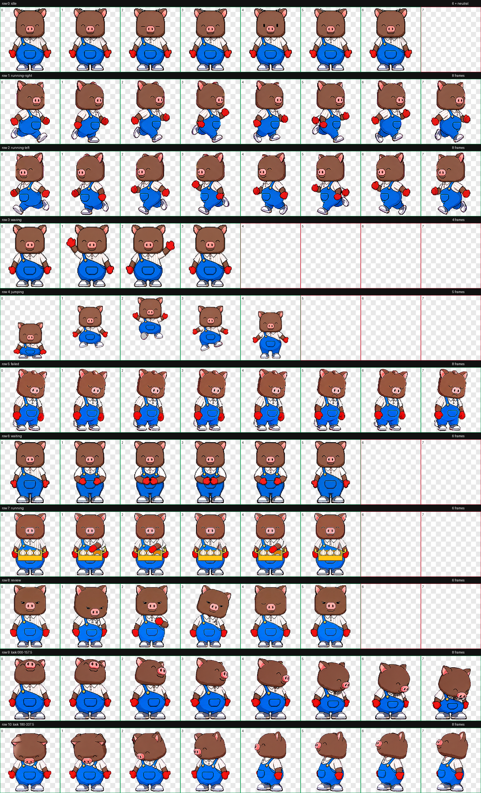

# 黑毛 Codex Pet

钱大妈品牌 IP “黑毛”的 Codex App 自定义宠物包。

“黑毛”是[钱大妈官网公开发布的品牌 IP 角色](https://www.qdama.cn/brandIP)。本项目由钱大妈员工基于公开品牌形象制作，用于本地 Codex App 个性化展示，不代表钱大妈官方软件产品或技术支持承诺。

## 预览



## 安装

### Petdex 安装

Petdex 审核上线后，可在已安装 Node.js 20 或更高版本的 macOS、Linux 或 Windows 上运行：

```bash
npx -y petdex@latest install hei-mao
```

Petdex CLI 会同时安装到 Petdex Desktop 与 Codex App 的宠物目录：

```text
~/.petdex/pets/hei-mao
~/.codex/pets/hei-mao
```

### 品控官角色

品控官角色已在 Petdex 建立独立条目。当前仓库图集为最新版本；Petdex 线上资源待其编辑链路修复后同步。同步完成后可运行：

```bash
npx -y petdex@latest install hei-mao-quality
```

在同步前，本地安装请使用仓库中的角色包目录：

```bash
mkdir -p ~/.codex/pets/hei-mao-quality
cp pets/hei-mao-quality/pet.json pets/hei-mao-quality/spritesheet.webp ~/.codex/pets/hei-mao-quality/
```

### 一键安装

macOS / Linux:

```bash
curl -fsSL https://raw.githubusercontent.com/MisonL/hei-mao/main/install.sh | bash
```

Windows PowerShell:

```powershell
irm https://raw.githubusercontent.com/MisonL/hei-mao/main/install.ps1 | iex
```

默认安装到 Codex 自定义宠物目录：

```text
~/.codex/pets/hei-mao
```

如需指定 Codex 配置目录：

```bash
curl -fsSL https://raw.githubusercontent.com/MisonL/hei-mao/main/install.sh | CODEX_HOME=/path/to/.codex bash
```

Windows PowerShell:

```powershell
$env:CODEX_HOME="C:\Users\you\.codex"; irm https://raw.githubusercontent.com/MisonL/hei-mao/main/install.ps1 | iex
```

安装器在交互式终端中会显示黑毛小猪 ASCII 动画；日志或管道环境会自动退化为静态输出。需要手动关闭动画时，可设置 `HEI_MAO_NO_ANIMATION=1`。

### 手动安装

将本仓库复制到 Codex 自定义宠物目录，或只复制根目录下这两个文件：

```text
pet.json
spritesheet.webp
```

推荐目录结构：

```bash
mkdir -p ~/.codex/pets/hei-mao
cp pet.json spritesheet.webp ~/.codex/pets/hei-mao/
```

然后在 Codex App 中：

1. 打开 `设置 -> 外观 -> 宠物`
2. 点击 `刷新`
3. 在自定义宠物中选择 `黑毛`

## 文件说明

- `pet.json`: Codex App 宠物清单文件
- `spritesheet.webp`: v2 11 行动画精灵图，尺寸 `1536x2288`
- `qa/contact-sheet.png`: 动画帧总览
- `qa/validation.json`: atlas 验证结果
- `qa/review.json`: 帧提取与透明度检查结果
- `qa/look-directions.png`: 16 个观察方向总览
- `qa/direction-blind-validation.json`: 方向盲测结果
- `qa/look-continuity.json`: 方向连续性测量
- `qa/videos/`: 每个状态的 mp4 预览
- `prompts/`: 生成 base 和各动画行时使用的提示词
- `pet_request.json`: 本次宠物生成请求配置

## 验证结果

本包已通过 hatch-pet 校验：

- `spritesheet.webp`: `WEBP` / `RGBA`
- `spriteVersionNumber`: `2`
- 尺寸: `1536x2288`
- 单元格: `192x208`
- `validation.json`: `ok: true`
- `review.json`: `ok: true`
- `direction-blind-validation.json`: `ok: true`
- 错误: 0
- 图集透明 RGB 残留: 0
- 独立最终视觉复核: WARN（无 BLOCK）；247.5 -> 270、337.5 -> 000 为较大但可接受的方向过渡，000 的 y=12 透明行保留在连续性报告中

## 动画状态

- `idle`: 6 帧
- `running-right`: 8 帧
- `running-left`: 8 帧
- `waving`: 4 帧
- `jumping`: 5 帧
- `failed`: 8 帧
- `waiting`: 6 帧
- `running`: 6 帧
- `review`: 6 帧

## 备注

`running-left` 为单独生成，不是从 `running-right` 镜像派生，以避免破坏黑毛单肩背带裤的方向特征。

## 许可

- 本仓库采用分离许可，详见[许可说明](LICENSE)。
- `install.sh`、`install.ps1` 及其独立功能性代码采用 [Apache License 2.0](LICENSES/Apache-2.0.txt)。
- 钱大妈、黑毛及相关角色图集、图片、视频、品牌描述和生成提示词不属于 Apache-2.0 授权范围，适用[品牌资产使用条款](ASSETS-LICENSE.md)。
- Apache-2.0 和品牌资产使用条款均不授予钱大妈或黑毛相关商标权。
