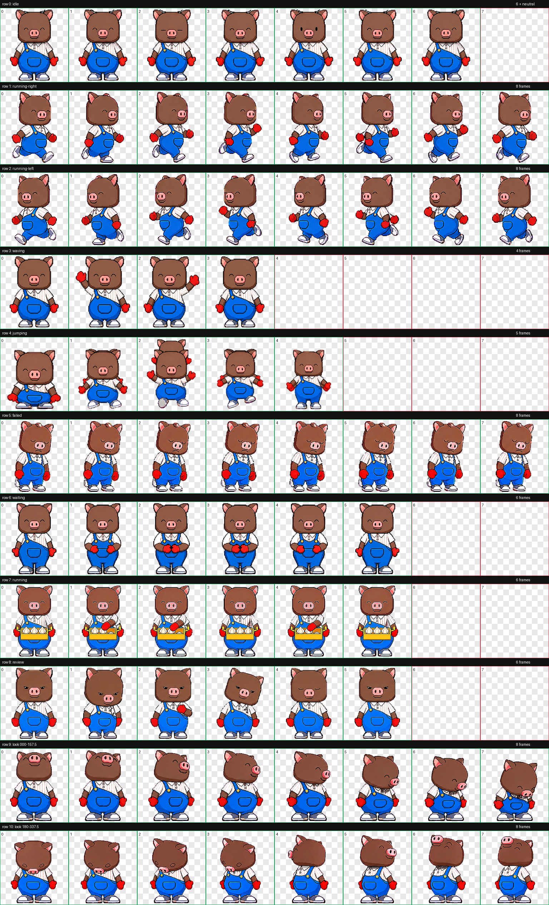

# 黑毛 Codex Pet

钱大妈品牌 IP “黑毛”的 Codex App 自定义宠物包。

“黑毛”是[钱大妈官网公开发布的品牌 IP 角色](https://www.qdama.cn/brandIP)。本项目由钱大妈员工基于公开品牌形象制作，用于本地 Codex App 个性化展示，不代表钱大妈官方软件产品或技术支持承诺。

## 预览



## 安装

### Petdex 安装

根包已有 Petdex 公开条目；线上资源版本仍以 manifest 为准。已安装 Node.js 20 或更高版本的 macOS、Linux 或 Windows 可运行：

```bash
npx -y petdex@latest install hei-mao
npx -y petdex@latest install hei-mao-butler
npx -y petdex@latest install hei-mao-chef
npx -y petdex@latest install hei-mao-foodie
npx -y petdex@latest install hei-mao-delivery
npx -y petdex@latest install hei-mao-fortune
npx -y petdex@latest install hei-mao-traveler
```

2026-08-18（北京时间）复核中 PetDex CLI 为 `1.2.2`。最新 manifest 生成时间为 `2026-08-18T06:29:10.591Z`，共 4568 个条目；八个当前黑毛角色均已公开，`hei-mao-2` 仍是历史重复条目。八个公开 `petjson.json` 和图集均可下载，实际 metadata 均为 v2、1536x2288、RGBA。`hei-mao-butler` 和 `hei-mao-chef` 的线上资源与仓库一致；其余六个角色的本地修复图集仍未切换到线上，manifest 索引版本与实际 metadata 仍有 v1/v2 漂移。Fortune 与 Traveler 已公开但线上仍是提交审核时的旧图集，本地当前 v2 图集的 owned-slug 编辑仍待审核，未创建重复条目。manifest 索引版本不能替代实际 metadata 和图集校验。最新 manifest/SHA 见 `qa/petdex-live-recheck-20260818-v5.json`，本地门禁和远端同步见 `qa/current-v2-gate-recheck-20260818-v4.json`，隔离安装见 `qa/petdex-live-install-recheck-20260818-v2.json`；本地 v2 图集可通过下方角色安装器获取，但 Quality 当前因比例阻断暂不分发。

本机全局 PetDex CLI 已升级并复核为 `1.2.2`；PetDex Desktop 最新公开版本为 `v0.8.0`，官方签名 DMG 已校验并安装到标准 Applications 目录，但本轮没有启动应用，也没有停止或重启任何 Codex 进程。安装与签名证据见 `qa/petdex-desktop-install-recheck-20260814.json`。`petdex bubble` 在 stdin 已收到 payload 但写端保持打开时仍会等待 EOF，#689 仍未修复；本地复现和版本边界见 `qa/petdex-local-cli-recheck-20260814.json`。

Petdex CLI 会同时安装到 Petdex Desktop 与 Codex App 的宠物目录：

```text
~/.petdex/pets/hei-mao
~/.codex/pets/hei-mao
```

### 角色包状态

当前仓库中的角色包如下。每个角色都有独立的 `pet.json`、v2 图集和 QA 证据，不能用其他角色的图集替代；只有没有视觉阻断的角色才会进入安装器白名单。

| slug              | 角色   | 本地状态               | Petdex 状态                |
| ----------------- | ------ | ---------------------- | -------------------------- |
| `hei-mao`         | 黑毛   | 已验证                 | manifest 可见，旧图集编辑仍待审核 |
| `hei-mao-quality` | 品控官 | 比例阻断，暂不分发 | manifest 可见，线上资源与本地修复均待审核 |
| `hei-mao-butler`  | 大管家 | 已验证                 | manifest index 为 v1，资源一致 |
| `hei-mao-chef`    | 厨师   | 已验证                 | manifest index 为 v1，资源一致 |
| `hei-mao-foodie`  | 美食家 | v2 已验证，可本地安装 | manifest 可见，旧图集编辑仍待审核 |
| `hei-mao-delivery` | 配送员 | v2 已验证，可本地安装 | manifest 可见，线上资源仍待仓库 v2 更新审核 |
| `hei-mao-fortune` | 福气官 | v2 已验证，可本地安装 | manifest 已公开，当前图集编辑待审核 |
| `hei-mao-traveler` | 旅行家 | v2 已验证，可本地安装 | manifest 已公开，当前图集编辑待审核 |

公开 manifest 当前包含八个当前角色条目和历史重复条目 `hei-mao-2`，总数为 4568；八个角色仍可通过 PetDex CLI 读取公开条目，但本仓库安装器暂时只分发其余七个角色，且安装成功不代表线上资源已经切换到仓库最新图集。当前线上与仓库一致的是 `hei-mao-butler` 和 `hei-mao-chef`；其余六个角色的 owned-slug 编辑仍待审核。最新资源、实际色键门禁和隔离下载见 `qa/petdex-live-recheck-20260818-v5.json`、`qa/current-v2-gate-recheck-20260818-v4.json` 和 `qa/petdex-live-install-recheck-20260818-v2.json`；旧提交和编辑快照仅用于追溯。

Petdex CLI 会把成功安装的角色同时写入 Petdex Desktop 与 Codex App 的宠物目录：

```text
~/.petdex/pets/<slug>
~/.codex/pets/<slug>
```

此前的 2026-08-10、2026-08-13 和 v2-v35 复核快照仍保留在对应 `qa/` 文件中，仅用于追溯历史漂移，不代表当前线上状态。`qa/current-state-recheck-20260817-v7.json` 代表比例修复前状态；本轮五个角色的比例修复以及 Quality row 10 的整行等比修复以各自 `proportion-repair-*.json`、`final-visual-qa.json` 和 `run-summary.json` 为准。PetDex 最新 manifest、公开资源和隔离下载以 `qa/petdex-live-recheck-20260818-v5.json`、`qa/current-v2-gate-recheck-20260818-v4.json` 和 `qa/petdex-live-install-recheck-20260818-v2.json` 为准；Desktop、Hook 和 Codex App 的边界仍以专项证据为背景，不能替代新的线上发布结论。

本机当前保留八个角色，但 `hei-mao-quality` 的 look row 9/10 存在已确认的整行比例阻断，暂不进入安装器分发白名单；其余七个角色的 v2 结构、透明度和连续性门禁通过。Quality row 10 的确定性等比修复仅将高度调整到 `162-169px`，仍低于中性帧约 `198px`，不能替代两条 coherent look row 的重新生成。仓库、Codex 与 PetDex 的旧 Quality 文件仍保留用于追溯，不得据此宣称当前 Quality 资源已验收。证据见 `qa/hei-mao-quality/final-visual-qa.json`、`qa/hei-mao-quality/run-summary.json`、`qa/hei-mao-quality/proportion-recheck-20260818.json` 和 `qa/current-v2-gate-recheck-20260818-v3.json`；本地生图服务恢复前 goal 保持 active。

此前本地安装器隔离验证已通过 Shell 和 PowerShell 的八个角色，并确认未知 slug 不会写入；当前 `hei-mao-quality` 因比例阻断已从安装器白名单移出，已有本地文件不删除。其余七个角色的 PetDex 在线安装、资源 SHA 和远端分支对照见 `qa/petdex-live-recheck-20260818-v5.json` 和 `qa/petdex-live-install-recheck-20260818-v2.json`，但线上资源仍可能是审核前旧图集。Petdex Desktop `v0.8.0` 的历史签名、窗口和双屏证据仍保留在专项 QA 中；最新 ChatGPT/Codex App 只读探针确认进程存在，但窗口查询在安全超时内未返回，未执行设置或宠物操作，Codex App 的本轮视觉验收仍未完成，见 `qa/codex-app-boundary-recheck-20260818-v2.json`；未停止或重启任何 Codex 进程。PetDex PR #662（跨屏气泡锚定）和 #667（气泡与宠物间距）已合并；PR #583 已修复大输入排空和 EPIPE，但 #689 的宿主不关闭 stdin、持续等待 EOF 是不同问题，目前仍待上游修复；开放的 PR #710 也未改变 stdin EOF 语义。

### 角色安装器

无参数时安装 `hei-mao`。通过环境变量选择已经通过本仓库 QA 且未被阻断的角色：

```bash
HEI_MAO_PET_ID=hei-mao-chef curl -fsSL https://raw.githubusercontent.com/MisonL/hei-mao/main/install.sh | HEI_MAO_PET_ID=hei-mao-chef bash
```

PowerShell 可使用同一个环境变量，或直接传 `-PetId`：

```powershell
$env:HEI_MAO_PET_ID="hei-mao-chef"; irm https://raw.githubusercontent.com/MisonL/hei-mao/main/install.ps1 | iex
./install.ps1 -PetId hei-mao-chef
```

安装器只接受仓库中已有完整图集和固定 SHA 的角色，未知 slug 会显式失败。Windows PowerShell 5.1 的本地 checkout 可能受 Git `core.autocrlf` 影响，安装器会对文本 manifest 显式按 UTF-8/LF 规范化后再校验固定 SHA，二进制图集保持原样。角色包默认安装到 `~/.codex/pets/<slug>`；需要 Petdex Desktop 时请使用上面的 `petdex install`，不要手动复制到未知目录。

`hei-mao-fortune` 和 `hei-mao-traveler` 均已完成本地 v2 图集、结构门禁和视觉 QA，并加入安装器白名单；二者已进入公开 manifest，可使用 PetDex 在线安装命令，但当前本地图集更新仍在管理员审核队列。历史 `hei-mao-recommender` 和 `hei-mao-2` 也不属于当前发布集；三处本地目录没有这两个历史 slug 的残留。历史 slug 的最新复核见 `qa/historical-slug-recheck-20260816.json`。

`hei-mao-traveler` 是黑毛的小旅行家角色，使用红色旅行背心、绿色蔬菜纹样背包、叶菜和小福袋表达社区探访与新鲜食材探索。当前 11 行 v2 图集已完成比例归一化、单次 despill、透明度、边界、连续性和修复后方向盲测复核；horizontal-6 B 与 horizontal-7 保留 minor ambiguity warning，四个 cardinal 通过。当前可通过仓库安装器或 PetDex 在线安装用于本地观察；PetDex 当前图集编辑已排入审核队列。

本地手动安装角色时：

```bash
mkdir -p ~/.codex/pets/hei-mao
cp pets/hei-mao/pet.json pets/hei-mao/spritesheet.webp ~/.codex/pets/hei-mao/
```

Fortune 角色的本地安装：

```bash
HEI_MAO_PET_ID=hei-mao-fortune curl -fsSL https://raw.githubusercontent.com/MisonL/hei-mao/main/install.sh | HEI_MAO_PET_ID=hei-mao-fortune bash
```

Traveler 角色的本地安装：

```bash
HEI_MAO_PET_ID=hei-mao-traveler curl -fsSL https://raw.githubusercontent.com/MisonL/hei-mao/main/install.sh | HEI_MAO_PET_ID=hei-mao-traveler bash
```

### 大管家角色

`hei-mao-butler` 包含完整的 v2 动画图集和 16 个观察方向的独立 QA 证据。Petdex manifest 已公开该角色，线上 metadata 和精灵图与仓库一致；manifest 索引仍标为 v1，需要仓库 v2 图集时使用仓库安装器。

Petdex 安装：

```bash
npx -y petdex@latest install hei-mao-butler
```

### Chef 角色

`hei-mao-chef` 是黑毛的厨师角色包，已通过结构、透明度、方向盲测、连续性和独立视觉复核。连续性报告中的四处数值告警均已记录为 minor warning，未发现可见跳帧、裁切、比例突变、身份漂移或方向反转。

Petdex 安装：

```bash
npx -y petdex@latest install hei-mao-chef
```

### 美食家角色

`hei-mao-foodie` 是黑毛的美食家角色包。waiting 行已作为完整六帧行重新生成，结构、透明度、方向盲测、连续性和独立视觉复核均通过；没有 detached effects、身份漂移或比例/基线异常。仓库安装器已纳入该角色。

本地安装：

```bash
HEI_MAO_PET_ID=hei-mao-foodie curl -fsSL https://raw.githubusercontent.com/MisonL/hei-mao/main/install.sh | HEI_MAO_PET_ID=hei-mao-foodie bash
```

Petdex 安装：

```bash
npx -y petdex@latest install hei-mao-foodie
```

### 配送员角色

`hei-mao-delivery` 是黑毛的社区配送角色包，已通过 v2 图集、透明度、方向盲测和独立视觉复核。连续性报告中的耳间开放负空间和局部数值告警均已按 minor review resolution 复核，没有封闭透明洞、裁切、身份漂移、比例跳变或方向反转。当前仓库安装器已纳入该角色；Petdex manifest 已公开其 v2 metadata，但线上精灵图 SHA 仍与仓库不一致，仓库 v2 更新仍待审核切换。

本地安装：

```bash
HEI_MAO_PET_ID=hei-mao-delivery curl -fsSL https://raw.githubusercontent.com/MisonL/hei-mao/main/install.sh | HEI_MAO_PET_ID=hei-mao-delivery bash
```

Petdex 在线安装：

```bash
npx -y petdex@latest install hei-mao-delivery
```

当前线上精灵图尚未与仓库 v2 SHA 一致；需要固定 SHA 的已验证图集时仍可使用上面的仓库安装器，PetDex 线上更新以审核完成为准。

### 福气官角色

`hei-mao-fortune` 是黑毛的福气官角色包，使用红金服饰、爱心手套、屏幕右侧粮篮和屏幕左侧南瓜表达新鲜、丰盛和每日好彩头。当前包由通过 v2 门禁的标准动作行与 v13-final coherent 方向行重新组装，已通过单次 despill、9 个标准动作行、16 个方向、三份独立盲测和最终视觉复核；方向连续性中的局部 outlier 已记录为 minor warning，没有身份漂移、比例跳变、封闭透明洞、青色色键残留或方向反转。最新图集 SHA-256 为 `10056a01a1a85bd350f83e59e8e746540b873add65e8e360439f80a61cf197d9`，证据见 `qa/hei-mao-fortune/run-summary.json`。cardinal 生成重试的上游 502 记录仍保留在 `qa/fortune-cardinal-generation-recheck-20260816-v3.json`，失败尝试没有覆盖已验收图集。

本地安装：

```bash
HEI_MAO_PET_ID=hei-mao-fortune curl -fsSL https://raw.githubusercontent.com/MisonL/hei-mao/main/install.sh | HEI_MAO_PET_ID=hei-mao-fortune bash
```

Petdex 发布状态：条目已进入公开 manifest，`npx -y petdex@latest install hei-mao-fortune` 已在隔离环境成功；本地最新 v2 图集更新已按 owned-slug 规则提交并排入管理员审核，当前线上仍是审核时的旧图集，没有重复 submit。当前资源、编辑队列和安装结果见 `qa/petdex-live-recheck-20260818-v5.json` 和 `qa/petdex-live-install-recheck-20260818-v2.json`；此前 `pending`/`409 pet_not_editable` 记录仅用于解释审核边界。

### 品控官角色

`hei-mao-quality` 是黑毛的品控官角色包。结构、透明度和方向语义门禁通过，但 row 9/10 相对中性帧明显偏矮，已被标记为比例阻断；在两条 coherent look row 重新生成并完成视觉 QA 前，不通过仓库安装器分发。

Petdex 安装：PetDex 中仍可见历史 `hei-mao-quality` 条目，但它不代表本仓库当前修复图集已通过比例验收；请等待本地两行重生成和 PetDex owned-slug 编辑审核完成。

Quality 当前只保留现有本地文件用于复核，不提供手动安装命令；row 9/10 完成重生成并通过视觉门禁后再恢复安装说明。

### 旅行家角色

`hei-mao-traveler` 是黑毛的小旅行家角色，使用红色旅行背心、绿色蔬菜纹样背包、叶菜和福袋表达社区探访与新鲜食材探索。其 11 行 v2 图集已完成单次 despill、透明度验证、三份独立方向盲测、连续性复核和最终视觉 QA；中间方向的盲测分歧与连续性 outlier 均按 minor warning 记录，四个 cardinal、身份、比例、回环和透明主体检查通过。

仓库安装器已固定 Traveler 图集 SHA-256 `d1f13ed88ff625f9698ca58f45d0870b017c55b7c052f1736b31b67c6a002b25`；Shell 和 PowerShell 的八角色隔离安装均已复核通过，修复后方向盲测保留 minor warning。

本地安装：

```bash
HEI_MAO_PET_ID=hei-mao-traveler curl -fsSL https://raw.githubusercontent.com/MisonL/hei-mao/main/install.sh | HEI_MAO_PET_ID=hei-mao-traveler bash
```

Petdex 发布状态：条目已进入公开 manifest，`npx -y petdex@latest install hei-mao-traveler` 已在隔离环境成功；本地最新 v2 图集更新已按 owned-slug 规则提交并排入管理员审核，当前线上仍是审核时的旧图集，没有重复 submit。当前资源、编辑队列和安装结果见 `qa/petdex-live-recheck-20260818-v5.json` 和 `qa/petdex-live-install-recheck-20260818-v2.json`。

### 一键安装

macOS / Linux:

```bash
curl -fsSL https://raw.githubusercontent.com/MisonL/hei-mao/main/install.sh | bash
```

Windows PowerShell:

```powershell
irm https://raw.githubusercontent.com/MisonL/hei-mao/main/install.ps1 | iex
```

默认安装到 Codex 自定义宠物目录：

```text
~/.codex/pets/hei-mao
```

通过 `HEI_MAO_PET_ID` 选择已验证角色，安装器会同时更换目标目录和远程资源路径；不传时安装 hei-mao。

如需指定 Codex 配置目录：

```bash
curl -fsSL https://raw.githubusercontent.com/MisonL/hei-mao/main/install.sh | CODEX_HOME=/path/to/.codex bash
```

Windows PowerShell:

```powershell
$env:CODEX_HOME="C:\Users\you\.codex"; irm https://raw.githubusercontent.com/MisonL/hei-mao/main/install.ps1 | iex
```

安装器在交互式终端中会显示黑毛小猪 ASCII 动画；日志或管道环境会自动退化为静态输出。需要手动关闭动画时，可设置 `HEI_MAO_NO_ANIMATION=1`。

### 手动安装

将本仓库复制到 Codex 自定义宠物目录，或只复制目标角色目录下这两个文件：

```text
pets/<slug>/pet.json
pets/<slug>/spritesheet.webp
```

推荐目录结构：

```bash
mkdir -p ~/.codex/pets/hei-mao
cp pets/hei-mao/pet.json pets/hei-mao/spritesheet.webp ~/.codex/pets/hei-mao/
```

然后在 Codex App 中：

1. 打开 `设置 -> 外观 -> 宠物`
2. 点击 `刷新`
3. 在自定义宠物中选择 `黑毛`

## 文件说明

- `pets/<slug>/pet.json`: Codex App 宠物清单文件
- `pets/<slug>/spritesheet.webp`: v2 11 行动画精灵图，尺寸 `1536x2288`
- `qa/<slug>/contact-sheet.png`: 动画帧总览
- `qa/<slug>/contact-sheet-extended.png`: 包含 16 个观察方向的 v2 动画帧总览
- `qa/<slug>/previews/*.gif`: 标准状态动画预览
- `qa/<slug>/preview-generation.json`（存在时）: 标准状态预览的相对路径、帧数和来源 SHA
- `qa/<slug>/look-mechanics.md`: 角色专属的 16 方向视线、锚点和道具跟随规则
- `qa/<slug>/run-summary.json`: 当前图集、结构门禁、视觉复核、方向 QA 和预览证据索引
- `qa/<slug>/validation.json`: atlas 验证结果
- `qa/<slug>/review.json`: 帧提取与透明度检查结果
- `qa/<slug>/look-directions.png`: 16 个观察方向总览
- `qa/<slug>/direction-blind-pairs.png`: 随机化的无标签方向盲测图
- `qa/<slug>/direction-blind-validation.json`: 方向盲测结果
- `qa/<slug>/direction-blind-verdicts-*.json`: 三份独立盲测投票与严格多数合并结果
- `qa/<slug>/direction-blind-answer-key.json`: 盲测完成后的隐藏答案记录
- `qa/<slug>/blind-review-resolution.json`: 中间方向 warning 的审查与处理决定
- `qa/<slug>/look-continuity.json`: 方向连续性测量
- `pets/hei-mao/`: 根角色包
- `qa/hei-mao/`: 根角色的独立验证与视觉复核证据
- `pets/hei-mao-quality/`: 品控官角色包（当前 look row 9/10 比例阻断，不作为可发布包）
- `qa/hei-mao-quality/`: 品控官的结构、盲测、比例阻断与视觉复核证据
- `pets/hei-mao-butler/`: 已验证的大管家角色包
- `qa/hei-mao-butler/`: 大管家 v2 的独立验证与视觉复核证据
- `pets/hei-mao-chef/`: 已验证的厨师角色包（Petdex manifest 可见，线上资源与仓库一致）
- `qa/hei-mao-chef/`: 厨师 v2 的独立验证与视觉复核证据
- `pets/hei-mao-foodie/`: 已通过最终视觉 QA 的美食家 v2 角色包
- `qa/hei-mao-foodie/`: 美食家 v2 的结构、方向和视觉复核证据
- `pets/hei-mao-delivery/`: 已通过最终视觉 QA 的配送员 v2 角色包
- `qa/hei-mao-delivery/`: 配送员 v2 的结构、方向、alpha 复核和视觉证据
- `pets/hei-mao-fortune/`: 已通过最终视觉 QA 的福气官 v2 角色包
- `qa/hei-mao-fortune/`: 福气官 v2 的结构、方向、盲测、连续性和视觉证据
- `pets/hei-mao-traveler/`: 已通过最终视觉 QA 的旅行家 v2 角色包
- `qa/hei-mao-traveler/`: 旅行家 v2 的结构、方向、盲测、连续性和视觉证据
- `qa/petdex-desktop-live-smoke-20260809.json`: Petdex Desktop 单角色实时烟测；不替代 Codex App 全量验收
- `qa/petdex-desktop-live-smoke-20260810.json`: Desktop 0.6.0 hook stdin 退出门禁与发布集复核；发现宿主保持 stdin 打开时原生 hook 仍会等待 EOF，不能据此宣称 App 验收完成
- `qa/petdex-local-cli-recheck-20260814.json`: 全局 CLI 1.2.2、Desktop v0.8.0 发布边界和 #689 Hook EOF 阻塞复现；不含本机路径或进程标识
- `qa/petdex-desktop-install-recheck-20260814.json`: 官方 Desktop v0.8.0 DMG SHA、签名、公证、标准目录安装和未启动 Codex 边界；不含本机路径或进程标识
- `qa/petdex-desktop-live-recheck-20260814.json`: Desktop v0.8.0 运行烟测、Pets 设置视图、活动角色和未修改 Codex 边界；不含本机路径或进程标识
- `qa/petdex-desktop-live-recheck-20260814-v2.json`: Desktop v0.8.0 动画帧变化、实际活动角色和未修改 Codex 边界；不含本机路径或进程标识
- `qa/petdex-desktop-live-recheck-20260814-v3.json`: Desktop v0.8.0 动画帧变化、旅行家与厨师之间的角色切换和恢复原角色证据；不含本机路径或进程标识
- `qa/petdex-multidisplay-recheck-20260810.json`: 双显示器实时窗口复核；Petdex 窗口可显示在另一块屏幕，但跨屏移动后气泡与宠物重叠，Codex App 多角色验收仍被阻断
- `qa/v2-contract-recheck-20260809.json`: 本轮五个角色的 v2 合同、安装一致性和技能测试复核
- `qa/v2-contract-recheck-20260810.json`: foodie 修复前的历史 v2 合同和视觉阻断快照
- `qa/current-package-install-recheck-20260810.json`: foodie 修复前的历史四角色安装一致性快照
- `qa/foodie-install-recheck-20260810.json`: foodie 修复后的 v2 合同、安装器、本机双目录一致性和公开文件卫生复核
- `qa/current-local-gate-recheck-20260810.json`: 基于当前提交重新执行的 v2 合同、hatch-pet 测试、安装器允许/拒绝路径、双目录一致性和公开文件卫生复核
- `qa/installer-isolation-recheck-20260813.json`: Bash 与 PowerShell 隔离安装器的七角色固定 SHA、历史/阻断 slug 拒绝和临时目标写入复核
- `qa/installer-cross-platform-recheck-20260818-v1.json`: 提交 `4cda613` 下七个可发布角色的 Bash 隔离安装、PowerShell Traveler 安装、Quality/历史 slug 双平台拒绝和临时目录清理复核；不含本机环境信息
- `qa/remote-installer-recheck-20260818.json`: 提交 `8ba0124` 下 GitHub/GitLab raw Bash 安装器各自 7/7 角色安装、固定 SHA、Quality/历史 slug 拒绝和临时目标清理复核；不含本机环境信息
- `qa/current-v2-gate-recheck-20260813.json`: 七个当前角色的 v2 atlas、单次 despill、标准动作、方向盲测、连续性和最终视觉 QA 门禁复核
- `qa/current-v2-gate-recheck-20260814-v2.json`: 当前八个角色按实际色键执行的 v2 atlas 结构门禁，全部通过且无透明 RGB 残留、错误或警告
- `qa/three-directory-parity-recheck-20260814-v1.json`: 仓库、Codex 和 PetDex 三个本地目录的八角色文件集合、metadata 和 SHA-256 一致性复核
- `qa/all-roles-v2-keyed-recheck-20260813.json`: 使用各角色实际抠像键重新执行的七角色 v2 结构、透明度和双目录 SHA 一致性复核
- `qa/current-release-gate-recheck-20260810-v2.json`: 提交 `a8db02d` 下五个角色的 v2 合同、实际双平台安装器隔离 smoke、28 项技能测试、双目录 SHA 和公开文件复核；Codex App 实时验收仍未完成
- `qa/current-release-gate-recheck-20260810.json`: 提交 `d1a849d` 下使用专用运行时的五角色 v2 合同、28 项技能测试、安装器解析和本机双目录 SHA 复核
- `qa/local-release-hygiene-recheck-20260810.json`: 最新角色身份、历史 slug 隔离、本机双目录 SHA、一键安装器和公开文件卫生复核
- `qa/remote-install-source-recheck-20260810.json`: GitHub/GitLab main、raw 下载源和安装器拒绝路径复核
- `qa/remote-main-sync-recheck-20260810.json`: GitHub/GitLab `main` 同提交、公开 raw 文件可用性和工作树同步复核
- `qa/remote-main-sync-recheck-20260813.json`: GitHub/GitLab `main` 远端分支、非强制同步和同步后同提交复核
- `qa/remote-main-sync-recheck-20260813-v2.json`: 本次文档与安装器更新后的 GitHub/GitLab `main` 提交、公开 README raw 内容和工作树一致性复核
- `qa/remote-release-source-recheck-20260810.json`: 基于 `82480ab` 的 GitHub/GitLab raw 文件、Petdex manifest/资源、PR #654 和正式路由即时复核
- `qa/imagegen-channel-recheck-20260810.json`: 本地生图 Agent 的 capabilities、runtime、契约、历史 smoke 和本轮失败生成请求复核；当前新角色生成保持阻断
- `qa/imagegen-channel-recheck-20260812.json`: 本地 Docker 生图服务的当前 capabilities、runtime、两条启用路径真实 smoke 和新角色生成阻断复核
- `qa/imagegen-channel-recheck-20260818-v1.json`: 品控官 row 10 重新生成前置检查；服务通道为 `probe_pending`，最近失败为 `403 INSUFFICIENT_BALANCE`，未提交新请求或安装隔离候选
- `qa/imagegen-channel-recheck-20260818-v2.json`: 本地 Docker 生图服务的只读 Agent capabilities、契约、runtime 和渠道健康复核；capabilities/契约返回 200/预期 400，runtime 返回 500 `disk I/O error`，渠道为 `probe_pending` 且最近失败为 `403 INSUFFICIENT_BALANCE`，未发起计费请求
- `qa/imagegen-channel-recheck-20260818-v3.json`: 当前只读生图前置复核；容器健康但 runtime 仍为 500 `disk I/O error`，无健康上游通道，未发起计费请求
- `qa/imagegen-channel-recheck-20260818-v4.json`: runtime 恢复为 200 后对两个独立 Agent request mode 执行最小真实 smoke；非流式与 SSE 均返回 403 且无图像/artifact，渠道进入 `probe_pending`，Quality 未提交生成请求
- `qa/imagegen-channel-recheck-20260818-v5.json`: 冷却到期后的恢复探针仍返回 403；两个新幂等键只在本地健康门禁收到 503，未向上游重复发起请求或提交 Quality 生成
- `qa/imagegen-channel-recheck-20260818-v6.json`: 冷却后使用新幂等键重试 Quality row 9；上游仍返回 403 `INSUFFICIENT_BALANCE`，服务回到 `probe_pending`，未产生图像或替换资产
- `qa/imagegen-channel-recheck-20260818-v7.json`: 切换本地 Docker 服务后再次使用全新幂等键重试 Quality row 9；唯一渠道仍为 `probe_pending` 且无有效请求方式，请求在本地健康门禁拒绝，未向上游发送、未产生图像或替换资产
- `qa/imagegen-channel-recheck-20260818-v8.json`: 真实编排入口使用全新幂等键执行 smoke；服务仍为 `probe_pending`，`images-non-stream/images-sse` 无健康凭证，未选择渠道、未向上游发送、未产生 artifact，Quality 两条 look row 继续阻断
- `qa/imagegen-channel-recheck-20260818-v9.json`: 2026-08-18T08:11:16Z 使用全新幂等键的本地 Agent 非流式 smoke；返回 503 `configuration_error`，唯一渠道仍为 `probe_pending`，最近上游失败为 403 `INSUFFICIENT_BALANCE`，无计费、无 artifact，Quality 两条 look row 继续阻断
- `qa/imagegen-channel-recheck-20260818-v10.json`: 2026-08-18T08:31:29Z 只读恢复轮询；Agent/runtime 契约正常但有效请求方式仍为空，唯一渠道 `probe_pending`，最近探针仍为 403 `INSUFFICIENT_BALANCE`，未发送新请求，Quality 两条 look row 继续阻断
- `qa/current-local-recheck-20260818-v1.json`: 生图重试后的八角色 v2 结构、方向连续性和 28 项 hatch-pet 回归测试复核；全部本地门禁通过，Quality 比例阻断仍保持
- `qa/hei-mao-quality/proportion-repair-20260818.json`: 品控官 row 10 八个方向的整行等比归一化、源输出 SHA 和高度对照；不含新生图请求，不能解除比例阻断
- `qa/hei-mao-quality/proportion-recheck-20260818.json`: 八个角色 look 行的只读 alpha 高度对照；确认 Quality 两个 cardinal 同时偏矮并记录生图服务阻断
- `qa/hei-mao-quality/chroma-despill-recheck-20260818.json`: 品控官等比修复后的透明度与既有单次去溢继承边界
- `qa/petdex-live-recheck-20260818-v2.json`: 2026-08-17T18:26:47.414Z manifest、八角色公开资源 SHA/metadata、GitHub/GitLab `a6d7a71` 主线提交对照；六个本地修复图集仍待 PetDex 审核，不含本机环境信息
- `qa/petdex-live-recheck-20260818-v3.json`: 2026-08-18T00:46:18.062Z manifest 和八角色公开 `petjson`/图集实际下载复核；八个 metadata 均为 v2、1536x2288、RGBA，只有大管家和厨师线上 SHA 与仓库一致，其余六个 owned-slug 更新仍待审核，不含本机环境信息
- `qa/petdex-live-recheck-20260818-v4.json`: 2026-08-18T06:29:10.591Z manifest 逐角色解析和公开资源复核；八个 metadata/下载图集均为 v2、1536x2288、RGBA，两个图集与仓库一致，六个 owned-slug 图集仍待审核，并记录 manifest 索引版本滞后，不含本机环境信息
- `qa/petdex-live-recheck-20260818-v5.json`: 2026-08-18T08:27:27Z 重新下载八个公开图集并校验 v2、1536x2288、RGBA 与 SHA；Butler/Chef 与仓库一致，其余六个 owned-slug 更新仍待审核，不含本机环境信息
- `qa/petdex-upstream-status-recheck-20260818.json`: 2026-08-18T08:41:31Z 只读核对 PetDex #603/#596/#654/#662/#667 等已关闭项，以及仍开放的 #689 Hook EOF 阻塞和不改变该语义的 #710 WIP；不含本机环境信息
- `qa/traveler-generation-blocked-20260813.json`: Traveler 生成前置服务连接拒绝时的历史安全阻断记录，不含本机环境信息
- `qa/traveler-generation-recheck-20260813.json`: Traveler 生成服务可达但上游图像路径被 429 限流的历史阻断记录，不含本机环境信息
- `qa/traveler-generation-recheck-20260813-v3.json`: Traveler 使用全新幂等键的历史生成阻断记录；上游返回 429，未产生图像，不含本机环境信息
- `qa/traveler-generation-recheck-20260814.json`: Traveler 当前生成阻断记录；两次页面 SSE 和一次显式 Agent JSON 请求均返回 429，未产生图像，不含本机环境信息
- `qa/traveler-generation-recheck-20260814-v2.json`: Traveler 早期 Agent API 真实编辑阻断记录，仅用于追溯
- `qa/traveler-generation-recheck-20260814-v3.json`: Traveler 页面 SSE 和 Agent JSON 对照阻断记录；两条路径均被上游限流，未产生图像，不含本机环境信息
- `qa/traveler-generation-recheck-20260814-v4.json`: Traveler 最新 Agent JSON 与页面 SSE 对照阻断记录；两条路径均返回 429，未产生 artifact，不含本机环境信息
- `qa/traveler-generation-recheck-20260814-v5.json`: Traveler 默认 Agent JSON、页面 SSE 和显式 Agent SSE 三路径阻断记录；均返回 429，未产生 artifact，不含本机环境信息
- `qa/traveler-generation-recheck-20260814-v6.json`: Traveler 服务编排入口最新真实 smoke 阻断记录；上游返回 429，未产生 artifact，不含本机环境信息
- `qa/current-state-recheck-20260814-v2.json`: 2026-08-14 早期状态快照，仅用于追溯
- `qa/current-state-recheck-20260814-v3.json`: 早期七角色显式色键 v2 门禁快照，仅用于追溯
- `qa/current-state-recheck-20260814-v4.json`: 当前七角色 v2 门禁、28 项测试、三处目录 parity、Petdex manifest、Traveler/App 未完成边界和远端一致性复核，不含本机环境信息
- `qa/current-state-recheck-20260814-v5.json`: 当前七角色 v2 门禁、28 项测试、三处目录 parity、跨平台安装器、Petdex manifest、Traveler/App 未完成边界和远端一致性复核，不含本机环境信息
- `qa/current-state-recheck-20260814-v6.json`: 当前七角色发布门禁、Petdex manifest、跨平台安装器、Traveler 双路径阻断、Codex App 未完成边界和远端一致性复核，不含本机环境信息
- `qa/current-state-recheck-20260814-v7.json`: 最新七角色发布门禁、Petdex manifest v3、本机三目录 parity、跨平台安装器、Traveler 双路径阻断、Codex App 未完成边界和远端一致性复核，不含本机环境信息
- `qa/current-state-recheck-20260814-v8.json`: 最新七角色发布门禁、Petdex manifest v3、本机三目录 parity、跨平台安装器、Traveler 新一轮双路径阻断、Codex App 未完成边界和远端一致性复核，不含本机环境信息
- `qa/current-state-recheck-20260814-v9.json`: 最新七角色发布门禁、Petdex manifest v3、本机三目录 parity、跨平台安装器、Traveler 三路径阻断、Codex App 未完成边界和远端一致性复核，不含本机环境信息
- `qa/current-state-recheck-20260814-v10.json`: post-commit 最新七角色发布门禁、Petdex manifest v3、本机三目录 parity、跨平台安装器、Traveler 三路径阻断、Codex App 未完成边界和远端一致性复核，不含本机环境信息
- `qa/current-state-recheck-20260814-v11.json`: 最新七角色逐包 v2 门禁、28 项测试、Petdex manifest v4、Traveler 服务编排阻断、Codex App 未完成边界和远端一致性复核，不含本机环境信息
- `qa/current-state-recheck-20260814-v12.json`: 最终七角色逐包 v2 门禁、28 项测试、Petdex CLI 登录与 telemetry 状态、三目录 parity、Traveler 阻断、Codex App 窗口边界和远端一致性复核，不含本机环境信息
- `qa/current-state-recheck-20260814-v13.json`: 八角色早期状态快照，仅用于追溯
- `qa/current-state-recheck-20260814-v15.json`: 当前八角色本地发布门禁、PetDex 编辑审核边界、三处目录 parity、远端一致性和 Codex App 视觉验收边界，不含本机环境信息
- `qa/current-state-recheck-20260814-v16.json`: 以当前远端同步提交为基线的八角色发布门禁、PetDex 资源/编辑边界、三处目录 parity、远端一致性和 Codex App 视觉验收边界，不含本机环境信息
- `qa/current-state-recheck-20260814-v17.json`: 2026-08-14 早期八角色发布门禁和 PetDex 边界快照，仅用于追溯，不含本机环境信息
- `qa/current-state-recheck-20260814-v18.json`: 2026-08-14 早期八角色发布门禁、PetDex 资源/编辑边界和上游 issue/PR 状态快照，仅用于追溯，不含本机环境信息
- `qa/current-state-recheck-20260814-v19.json`: 当前八角色发布门禁、QA 媒体完整性、PetDex 资源/编辑边界、上游 issue/PR 状态、CLI/Hook 边界、三处目录 parity、远端一致性和 Codex App 视觉验收边界，不含本机环境信息
- `qa/current-state-recheck-20260814-v20.json`: 官方 Desktop v0.8.0 安装后的八角色发布门禁、PetDex 资源/编辑边界、上游 issue/PR 状态、CLI/Hook 边界、三处目录 parity、远端一致性和 Codex App 视觉验收边界，不含本机环境信息
- `qa/current-state-recheck-20260814-v21.json`: Desktop v0.8.0 运行烟测后的八角色发布门禁、PetDex 资源/编辑边界、上游 issue/PR 状态、CLI/Hook 边界、三处目录 parity、远端一致性和 Codex App 视觉验收边界，不含本机环境信息
- `qa/current-state-recheck-20260814-v22.json`: Desktop v0.8.0 动画烟测后的八角色发布门禁、PetDex 资源/编辑边界、上游 issue/PR 状态、CLI/Hook 边界、三处目录 parity、远端一致性和 Codex App 视觉验收边界，不含本机环境信息
- `qa/current-state-recheck-20260814-v24.json`: Desktop v0.8.0 动画、角色切换和双屏气泡复测后的历史状态快照，仅用于追溯
- `qa/current-state-recheck-20260814-v25.json`: 基于提交 `e843623` 的历史八角色发布门禁和 PetDex 边界快照，仅用于追溯
- `qa/current-state-recheck-20260814-v26.json`: 基于提交 `44e85a9` 的历史八角色门禁、alpha-hole 复核、三处目录 parity、PetDex 公开状态、#583/#689 Hook 边界、远端同步和 Codex App 可访问性边界，不含本机环境信息
- `qa/current-state-recheck-20260814-v27.json`: 基于提交 `ab63934` 的当前八角色门禁、三处目录 parity、实时 PetDex manifest/资源/审核状态、#583/#689 Hook 边界、远端同步和 Codex App 可访问性边界，不含本机环境信息
- `qa/current-state-recheck-20260814-v28.json`: post-push 提交 `30f734a` 的远端一致性、资产基线不变、实时 PetDex 状态、#583/#689 Hook 边界和只读 Codex App 可访问性边界，不含本机环境信息
- `qa/current-state-recheck-20260814-v29.json`: 提交 `9c6be8c` 上的本地八角色安装、实时 PetDex manifest、上游 `main` SHA、#689 stdin 代码证据和 Desktop 边界复核，不含本机环境信息
- `qa/current-state-recheck-20260814-v30.json`: 提交 `ce2b7dc` 上新增跨平台安装器 smoke 后的本地八角色、实时 PetDex、上游 Hook 和 Desktop 边界复核，不含本机环境信息
- `qa/current-state-recheck-20260814-v31.json`: 提交 `4d5fcfd` 上的最新 manifest、本人提交的 GitHub issue/PR、上游 Hook 和本地发布边界复核，不含本机环境信息
- `qa/current-state-recheck-20260814-v32.json`: 提交 `10d426c` 后重启主机的只读 Codex App 边界复核，不含本机环境信息
- `qa/current-state-recheck-20260814-v33.json`: 提交 `d251c42` 上八角色本地包契约、安装器和外部阻断汇总，不含本机环境信息
- `qa/current-state-recheck-20260814-v34.json`: 提交 `b77a134` 上使用精确 hatch-pet runtime 的八角色 v2 门禁和剩余阻断汇总，不含本机环境信息
- `qa/current-state-recheck-20260814-v35.json`: 提交 `d8f9320` 上 hatch-pet 28 项测试、八角色 v2 门禁和剩余阻断汇总，不含本机环境信息
- `qa/current-state-recheck-20260816-v2.json`: 以提交 `cceca66` 为检查基线并记录发布提交 `56ead92`，包含八角色 v2 门禁、hatch-pet 测试、三目录 SHA parity、GitHub/GitLab main 同步和剩余发布阻断，不含本机环境信息
- `qa/current-state-recheck-20260816-v3.json`: 以提交 `9699e72` 为检查基线，记录八角色按实际色键 v2 门禁、28 项测试、安装器、三目录 SHA parity、双远端一致性和剩余发布边界，不含本机环境信息
- `qa/current-state-recheck-20260816-v4.json`: Fortune v2 基础图集纠错后的全角色门禁、盲测、安装器、三目录 parity 和剩余 PetDex/Codex App 边界，不含本机环境信息
- `qa/current-state-recheck-20260816-v5.json`: 八角色当前门禁、Fortune 盲测平票边界、PetDex manifest、Codex App 可访问性和双远端状态汇总，不含本机环境信息
- `qa/current-state-recheck-20260816-v6.json`: 当前提交上的八角色结构/连续性复核、28 项测试、三目录 parity、Shell/PowerShell 隔离安装器和公开发布边界，不含本机环境信息
- `qa/current-state-recheck-20260817-v1.json`: 提交 `a18c063` 上重新执行的八角色 v2 结构/连续性门禁、28 项测试、三目录 parity、双远端一致性、PetDex 公开资源和上游 issue/PR 复探、Codex App 未完成边界，不含本机环境信息
- `qa/current-state-recheck-20260817-v2.json`: 提交 `88d1120` 上重新执行的八角色 v2 结构/连续性门禁、28 项测试、安装器静态检查、三目录 parity、PetDex 资源重试结果、上游 issue/PR 和 Codex App 未完成边界，不含本机环境信息
- `qa/current-state-recheck-20260817-v3.json`: 提交 `577712c` 上的方向语义字段统一、QA 摘要索引、预览帧数、请求标识脱敏和八角色最终本地复核，不含本机环境信息
- `qa/current-state-recheck-20260817-v4.json`: 提交 `1c59260` 上按各角色实际色键重跑的八角色 v2 门禁、连续性、方向/盲测、三目录 parity、最新 PetDex manifest、#689 和 Codex App 边界，不含本机环境信息
- `qa/current-state-recheck-20260817-v5.json`: 证据提交 `9a7a975`（八角色门禁基线 `b86da01`）上的实时 atlas/连续性/方向门禁、隔离安装器、公开资源 CDN、#689 与开放 PR #710 边界；记录 Skill 测试在隔离 uv runtime 中 28 项通过、配置的 GitLab 镜像项目为 public 且已同步，不含本机环境信息
- `qa/current-state-recheck-20260817-v6.json`: 提交 `f0ce45f` 上使用 bundled Python 3.12.13 fresh 重跑八角色 v2/连续性/方向门禁、视觉 QA 资产基线、三目录 parity、PetDex 八角色公开安装、#689/PR #710 和 Codex App 边界，不含本机环境信息
- `qa/current-state-recheck-20260817-v7.json`: 提交 `9221c80` 上重新执行八角色 v2/连续性门禁、QA 产物完整性、安装器静态检查、三目录 SHA parity、八角色临时 HOME 在线安装、实时 manifest、上游 Hook 源码与本机 stdin stall 复现、Desktop release 和 Codex App 边界，不含本机环境信息
- `qa/current-state-recheck-20260817-v8.json`: 本轮五个角色比例归一化、八角色 fresh v2/连续性门禁、Traveler 修复后三份独立方向盲测、Shell/PowerShell 安装器和三目录 SHA parity；PetDex/Codex App 外部边界明确分开，不含本机环境信息
- `qa/current-v2-gate-recheck-20260818-v2.json`: 八角色色键 v2/连续性门禁、28 项 hatch-pet 测试、安装器解析与隔离安装、三目录 SHA parity 和 Quality look-row 比例阻断；不含本机环境信息
- `qa/current-v2-gate-recheck-20260818-v3.json`: 2026-08-18T07:50:43Z 新鲜八角色 v2/连续性门禁、28 项测试、QA 资产完整性、三目录 SHA parity、旧 slug 清理、安装器解析和双远端同步；唯一视觉阻断为 Quality 两条 look row 的完整重生成，不含本机环境信息
- `qa/current-v2-gate-recheck-20260818-v4.json`: 2026-08-18T08:24:22Z 再次执行八角色 v2 validator/连续性、28 项测试、QA 产物、三目录 parity、安装器、公开卫生和双远端同步；Quality 两条 look row 仍需完整重生成，不含本机环境信息
- `qa/current-state-recheck-20260818-v1.json`: 基于提交 `f80b910` 的八角色新鲜门禁、28 项测试、三目录 parity、安装器、PetDex 公开资源、生图服务和 Codex App 边界复核；不含本机环境信息
- `qa/codex-app-boundary-recheck-20260817.json`: ChatGPT/Codex App 进程、菜单栏和设置菜单可见性复核；窗口数为 0，宠物视图仍不可访问，未停止或重启 Codex 进程，不含本机环境信息
- `qa/petdex-live-install-recheck-20260817.json`: 2026-08-16 早期 PetDex CLI `1.2.2` 隔离安装六个公开角色的历史快照，仅用于追溯，不含本机环境信息
- `qa/petdex-live-recheck-20260817.json`: 最新 manifest 中八个黑毛角色均已公开、八个线上资源的 v2/尺寸/SHA 对照、Fortune/Traveler 当前 owned-slug 编辑队列和无重复提交边界，不含本机环境信息
- `qa/petdex-live-recheck-20260818-v2.json`: 2026-08-17T18:26:47.414Z manifest、八角色公开资源 SHA/metadata、GitHub/GitLab `a6d7a71` 主线提交对照；六个本地修复图集仍待 PetDex 审核，不含本机环境信息
- `qa/petdex-live-install-recheck-20260817-v2.json`: PetDex CLI `1.2.2` 隔离安装八个公开角色到两个目标根目录的真实结果、ID/v2/文件 parity 和公开资源编辑审核边界，不含本机环境信息
- `qa/petdex-live-install-recheck-20260818-v1.json`: PetDex CLI `1.2.2` 新鲜隔离安装八个公开角色、两个目录各 16 个文件及 SHA parity；六个本地修复图集仍待线上审核，不含本机环境信息
- `qa/petdex-live-install-recheck-20260818-v2.json`: PetDex CLI `1.2.2` 新鲜隔离安装七个可发布角色到两个临时目标，14+14 个文件 SHA parity 通过，Quality 与历史 `hei-mao-2` 按规则拒绝，临时目标已清理，不含本机环境信息
- `qa/codex-app-boundary-recheck-20260818.json`: ChatGPT/Codex App 当前只读进程和窗口探针；进程可见但窗口数为 0，未执行设置或进程控制，不含本机环境信息
- `qa/codex-app-boundary-recheck-20260818-v2.json`: 2026-08-18T08:37:49Z ChatGPT/Codex App 只读进程探针；窗口查询在安全 8 秒边界超时，未执行设置或进程控制，视觉验收仍未完成，不含本机环境信息
- `qa/fortune-cardinal-generation-recheck-20260816-v1.json`: Fortune cardinal 两种有效 request mode 的真实失败证据和未产出 artifact 边界，不含本机环境信息
- `qa/fortune-cardinal-generation-recheck-20260816-v2.json`: Fortune cardinal 第五次真实 502 失败、一次未发送的本地预检和只读诊断结果，不含本机环境信息
- `qa/fortune-cardinal-generation-recheck-20260816-v3.json`: Fortune cardinal 新增三次真实 502 失败和未替换正式图集的脱敏边界，不含本机环境信息
- `qa/petdex-fortune-edit-recheck-20260816.json`: Fortune owned-slug 编辑被 PetDex 以 409 `pet_not_editable`/`pending` 拒绝的脱敏结果，不含本机环境信息
- `qa/current-v2-gate-recheck-20260816-v1.json`: 提交 `e9c29e9` 前按每个角色记录的实际色键重新执行八角色 `validate_atlas.py --require-v2`，全部通过且无透明 RGB 残留、错误或警告
- `qa/petdex-live-recheck-20260816-v2.json`: 实时 PetDex manifest、公开资源 HTTP 状态与 SHA 对照、历史重复条目和 Fortune/Traveler 公开边界，不含本机环境信息
- `qa/petdex-live-recheck-20260816-v3.json`: 2026-08-16 06:25 manifest、公开资源 SHA 对照、历史重复条目和 Fortune/Traveler 公开边界，不含本机环境信息
- `qa/petdex-live-recheck-20260816-v4.json`: 2026-08-16 14:24 manifest 刷新、Fortune/Traveler 仍待审核边界和公开资源探针 TLS 超时记录，不含本机环境信息
- `qa/petdex-live-recheck-20260816-v5.json`: 2026-08-16 15:53 manifest、六个公开资源下载/哈希、v2 门禁和 Fortune/Traveler 发布边界，不含本机环境信息
- `qa/installer-cross-platform-recheck-20260814-v4.json`: 提交 `ce2b7dc` 上 Bash/PowerShell 八角色隔离安装、未知 slug 拒绝、ShellCheck 和临时目标清理证据，不含本机环境信息
- `qa/petdex-desktop-multidisplay-recheck-20260814-v1.json`: Desktop v0.8.0 宠物窗口跨屏移动时的气泡跟随、间距和位置恢复证据，不含屏幕截图或本机敏感信息
- `qa/qa-media-completeness-recheck-20260814.json`: 八个角色的标准接触表、根包和大管家标准状态预览、来源 SHA 与公开路径完整性证据
- `qa/current-v2-alpha-review-20260814.json`: 当前提交八个角色的 v2 门禁、look-continuity alpha-hole 候选高对比度复核和透明连通性结论；未发现封闭主体透明洞
- `qa/current-v2-gate-recheck-20260814-v3.json`: 提交 `ab63934` 上使用各角色实际色键重新执行的八角色 `validate_atlas.py --require-v2` 结果，全部通过且无透明 RGB 残留、错误或警告
- `qa/current-v2-gate-recheck-20260814-v4.json`: 提交 `b77a134` 上使用精确 hatch-pet Python runtime 重新执行的八角色 `validate_atlas.py --require-v2` 结果，全部通过且无透明 RGB 残留、错误或警告
- `qa/hatch-pet-runtime-test-recheck-20260814-v1.json`: 提交 `d8f9320` 上使用精确 hatch-pet runtime 运行的 28 项标准测试结果
- `qa/three-directory-parity-recheck-20260814-v2.json`: 提交 `ab63934` 上仓库、Codex 和 PetDex 三个本地目录的八角色文件集合和 SHA-256 一致性复核
- `qa/codex-app-boundary-recheck-20260814-v2.json`: 脱敏的只读 App 可见性检查；目标宠物界面未出现，不代表视觉验收通过
- `qa/codex-app-boundary-recheck-20260814-v3.json`: macOS System Events 只读窗口/菜单栏计数检查；目标宠物界面仍未暴露，不代表视觉验收通过
- `qa/installer-cross-platform-recheck-20260814-v2.json`: Shell 和 PowerShell 七角色隔离安装、SHA 校验、Traveler 拒绝和临时目标清理复核，不含本机环境信息
- `qa/current-local-gate-live-recheck-20260813.json`: 七个角色实时 v2 结构门禁、双目录 SHA 一致性和安装器隔离复核，不含本机环境信息
- `qa/petdex-current-recheck-20260813.json`: 2026-08-13 的 Petdex CLI、manifest、线上资源 SHA、编辑路由、上游合并和相关条目历史复核
- `qa/petdex-current-recheck-20260814.json`: 2026-08-14 早期 Petdex 状态快照，仅用于追溯
- `qa/petdex-current-recheck-20260814-v2.json`: 当前 Petdex manifest、六个公开角色线上 SHA、本机三目录 parity、Fortune/Traveler 发布边界复核
- `qa/petdex-current-recheck-20260814-v3.json`: 最新 Petdex manifest、六个公开角色线上 SHA、本机三目录 parity、Fortune/Traveler 发布边界复核；当前 Petdex 证据
- `qa/petdex-current-recheck-20260814-v4.json`: 最新 Petdex manifest、六个公开角色线上 SHA、本机 v2 SHA 对照、Fortune/Traveler 发布边界复核；当前 Petdex 证据
- `qa/petdex-current-recheck-20260814-v5.json`: 2026-08-14 的历史 Petdex CLI、manifest 和线上资源快照，仅用于追溯
- `qa/petdex-current-recheck-20260814-v7.json`: 实时 `petdex list`、manifest、已有编辑队列、Fortune/Traveler 审核状态和 #689 状态复核
- `qa/petdex-public-resource-recheck-20260814.json`: 2026-08-14 早期公开资源快照，仅用于追溯审核前资源未切换的边界
- `qa/petdex-public-resource-recheck-20260814-v2.json`: 历史公开 manifest 和六个公开角色资源 SHA 快照，仅用于追溯
- `qa/petdex-public-resource-recheck-20260814-v3.json`: 2026-08-14 早期公开 manifest、六个公开角色实际下载资源的 SHA/尺寸和 metadata 字节/语义对照，仅用于追溯
- `qa/petdex-public-resource-recheck-20260814-v4.json`: 历史公开 manifest、六个公开角色实际下载资源的 SHA/尺寸和 metadata 字节/语义对照
- `qa/petdex-public-resource-recheck-20260814-v5.json`: 最新实时公开 manifest、七个 `hei-mao*` 条目和本地角色 CDN SHA 对照
- `qa/codex-app-boundary-recheck-20260814-v4.json`: 重启主机后的只读 Codex App 可访问性边界，不含本机环境信息
- `qa/codex-app-boundary-recheck-20260816.json`: 当前主机只读 System Events 查询；目标 Codex App 宠物设置仍未暴露，不含本机环境信息
- `qa/local-package-contract-recheck-20260814-v5.json`: 八角色 pet.json 契约、三目录 SHA、Bash/PowerShell 安装器和 QA JSON 复核，不含本机环境信息
- `qa/petdex-edit-sync-recheck-20260814.json`: `hei-mao`、`hei-mao-quality` 和 `hei-mao-foodie` 的已有 slug 编辑队列及提交后 manifest 状态
- `qa/petdex-edit-submit-recheck-20260813.json`: `hei-mao`、`hei-mao-quality` 和 `hei-mao-foodie` 的已有 slug 编辑提交、审核队列和提交后 manifest 状态复核
- `qa/petdex-fortune-submit-blocked-20260813.json`: Fortune 提交在未登录状态下于上传前安全阻断的历史记录
- `qa/petdex-fortune-submit-recheck-20260813.json`: Fortune 进入公开 manifest 前的提交/审核历史快照，仅用于追溯
- `qa/petdex-traveler-submit-recheck-20260814.json`: Traveler 进入公开 manifest 前的提交/审核历史快照，仅用于追溯
- `qa/current-local-app-boundary-recheck-20260813.json`: 七角色本地门禁、安装器隔离和 Codex App 实时验收边界复核
- `qa/petdex-sync-recheck-20260809.json`: Petdex manifest、编辑接口和 PR #654 状态复核
- `qa/petdex-sync-recheck-20260810.json`: 最新 Petdex manifest、编辑接口和 PR #654 状态复核
- `qa/remote-petdex-pr-recheck-20260810.json`: 当前 Petdex manifest、公开资源 SHA、编辑路由和 PR #654 最新审查/部署状态复核
- `qa/petdex-live-install-recheck-20260810.json`: Petdex 1.2.0 当前 manifest、隔离安装、公开资源 SHA 漂移和 `doctor` 移除状态复核
- `qa/petdex-edit-route-recheck-20260810.json`: PR #654 当前检查、Vercel 授权阻断和正式编辑接口状态复核
- `qa/petdex-pr-654-merge-recheck-20260810.json`: PR #654 已合并、生产编辑路由已部署及剩余 v2 同步门禁复核
- `qa/cross-platform-installer-recheck-20260810.json`: Windows 10 PowerShell 5.1 与 Linux x86_64 隔离安装器复核及远端网络可达性结果
- `qa/active-selection-recheck-20260810.json`: 活动角色选择、双目录发布集和 Codex/Petdex Desktop 画面验收边界复核
- `prompts/`: 生成 base 和各动画行时使用的提示词
- `pet_request.json`: 本次宠物生成请求配置

## 验证结果

本包已通过 hatch-pet 校验：

- `pets/hei-mao/spritesheet.webp`: `WEBP` / `RGBA`
- `spriteVersionNumber`: `2`
- 尺寸: `1536x2288`
- 单元格: `192x208`
- `qa/hei-mao/validation.json`: `ok: true`
- `qa/hei-mao/review.json`: `ok: true`
- `qa/hei-mao/direction-blind-validation.json`: `ok: true`
- 错误: 0
- 图集透明 RGB 残留: 0
- 独立最终视觉复核: WARN（无 BLOCK）；247.5 -> 270、337.5 -> 000 为较大但可接受的方向过渡，000 的 y=12 透明行保留在连续性报告中

## 动画状态

- `idle`: 6 帧
- `running-right`: 8 帧
- `running-left`: 8 帧
- `waving`: 4 帧
- `jumping`: 5 帧
- `failed`: 8 帧
- `waiting`: 6 帧
- `running`: 6 帧
- `review`: 6 帧

## 备注

`running-left` 为单独生成，不是从 `running-right` 镜像派生，以避免破坏黑毛单肩背带裤的方向特征。

### 品控官 v5 验证结果

- `pets/hei-mao-quality/spritesheet.webp`: `WEBP` / `RGBA`，SHA-256 为 `3a117af73f978216cff925c55abc97aa3f41cd79635efab3cf77a78e445f8696`
- 尺寸 `1536x2288`，单元格 `192x208`，`spriteVersionNumber: 2`
- quality 图集使用洋红色抠像键 `#FF00FF`；独立复核时运行 `validate_atlas.py --require-v2 --chroma-key '#FF00FF' pets/hei-mao-quality/spritesheet.webp`
- `qa/hei-mao-quality/validation.json`: `ok: true`，错误 0，透明 RGB 残留 0
- `qa/hei-mao-quality/chroma-despill-recheck-20260818.json`: `ok: true`，沿用既有单次边缘色键去溢，等比修复后未追加第二次全图去溢
- `qa/hei-mao-quality/direction-blind-validation.json`: `ok: true`，`000=up`、`180=down`、`270=screen-left` 硬门禁通过
- `qa/hei-mao-quality/final-visual-qa.json`: `blocked_proportion_regression`；row 9 为 `159-169px`、row 10 为 `162-169px`，均明显低于中性帧约 `198px`
- 连续性指标在 `157.5 -> 180`、`225 -> 247.5` 与 `337.5 -> 000` 处有已复核的边界警告；正常尺寸下未见身份变化、错误象限、方向反转或透明内部洞

### 大管家 v2 验证结果

- `pets/hei-mao-butler/spritesheet.webp`: `WEBP` / `RGBA`，SHA-256 为 `1e59bcd0024b4f381e740655e2457df490773e7038ea3f77f073f3ac5ca46304`
- 尺寸 `1536x2288`，单元格 `192x208`，`spriteVersionNumber: 2`
- `qa/hei-mao-butler/validation.json`: `ok: true`，错误 0，透明 RGB 残留 0
- `qa/hei-mao-butler/chroma-despill.json`: `ok: true`，单次边缘色键去溢完成
- `qa/hei-mao-butler/direction-blind-validation.json`: `ok: true`，四个 cardinal 硬门禁通过
- `qa/hei-mao-butler/final-visual-qa.json`: `pass_with_reviewed_warnings`，无需要修复的动作行
- 中间/背面方向的次轴提示较弱，且连续性报告有局部离群值；独立正常尺寸复核未见跳帧、裁切、透明洞、比例突变或方向反转

### 厨师 v2 验证结果

- `pets/hei-mao-chef/spritesheet.webp`: `WEBP` / `RGBA`，SHA-256 为 `32a4df73b3ecc58c0f1488025a841fb7be7c93127d3f0134f22d6c799580d957`
- 尺寸 `1536x2288`，单元格 `192x208`，`spriteVersionNumber: 2`
- `qa/hei-mao-chef/validation.json`: `ok: true`，错误 0，透明 RGB 残留 0
- `qa/hei-mao-chef/chroma-despill.json`: `ok: true`，单次边缘色键去溢完成
- `qa/hei-mao-chef/direction-blind-validation.json`: `ok: true`，四个 cardinal 硬门禁通过
- `qa/hei-mao-chef/final-visual-qa.json`: `pass_with_reviewed_warnings`，无需要修复的动作行
- 连续性告警集中在 `157.5 -> 180`、`225 -> 247.5`、`247.5 -> 270` 和 `337.5 -> 000`；正常尺寸下未见跳帧、裁切、比例突变、身份漂移或方向反转

### 美食家 v2 验证结果

- `pets/hei-mao-foodie/spritesheet.webp`: `WEBP` / `RGBA`，SHA-256 为 `eba3849e27fdebb6f1df4f5cacc39328f2b6c7e97f5e11fb15b3ebff11b2d3b0`
- `pets/hei-mao-foodie/pet.json`: SHA-256 为 `0857baacd1dbb5912ceb03a5fc4cadf121923f6d04190b9356f7588f82410a6c`
- `spriteVersionNumber: 2`，尺寸 `1536x2288`，单元格 `192x208`
- `qa/hei-mao-foodie/validation.json`: `ok: true`，错误 0，透明 RGB 残留 0
- `qa/hei-mao-foodie/chroma-despill.json`: `ok: true`，单次边缘色键去溢完成
- `qa/hei-mao-foodie/direction-blind-validation.json`: `ok: true`，四个 cardinal 硬门禁通过
- `qa/hei-mao-foodie/final-visual-qa.json`: `pass`，waiting 行完整重生成后无 detached effects；独立视觉复核记录 minor warning

### 配送员 v2 验证结果

- `pets/hei-mao-delivery/spritesheet.webp`: `WEBP` / `RGBA`，SHA-256 为 `6b3ceef6f74aa92d503eed294ee04b7dd65c53504ce31aa5a8e30c0ff252fe86`
- `pets/hei-mao-delivery/pet.json`: SHA-256 为 `16e5e9aaf0033e4676b7a298f55562607382a1a1d1fbe7ecf4377ffcd86c46a2`
- `spriteVersionNumber: 2`，尺寸 `1536x2288`，单元格 `192x208`
- `qa/hei-mao-delivery/validation.json`: `ok: true`，错误 0，透明 RGB 残留 0
- `qa/hei-mao-delivery/chroma-despill.json`: `ok: true`，单次边缘色键去溢完成
- `qa/hei-mao-delivery/direction-blind-validation.json`: `ok: true`，四个 cardinal 硬门禁通过
- `qa/hei-mao-delivery/final-visual-qa.json`: `pass_with_reviewed_warnings`；耳间开放负空间和局部连续性告警已由独立复核与 alpha 连通性证据确认，不存在封闭透明洞或方向反转
- `qa/petdex-delivery-submit-20260811.json`: 配送员首次提交的历史记录；当前线上状态以 `qa/petdex-live-recheck-20260818-v5.json` 为准，线上精灵图仍与仓库 v2 SHA 不一致

## 许可

- 本仓库采用分离许可，详见[许可说明](LICENSE)。
- `install.sh`、`install.ps1` 及其独立功能性代码采用 [Apache License 2.0](LICENSES/Apache-2.0.txt)。
- 钱大妈、黑毛及相关角色图集、图片、视频、品牌描述和生成提示词不属于 Apache-2.0 授权范围，适用[品牌资产使用条款](ASSETS-LICENSE.md)。
- Apache-2.0 和品牌资产使用条款均不授予钱大妈或黑毛相关商标权。
